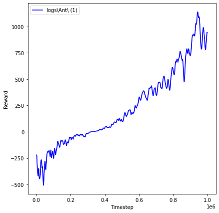
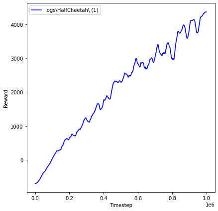

# Tensorflow 2 PPO Implementation for MuJoCo Gym Environments
This is a simple implementation of the PPO Algorithm based on its accompanying [paper](https://arxiv.org/pdf/1707.06347.pdf) for use in MuJoCo gym environments.

This repository was mainly made for learning purposes.

# Requirements
- [MuJoCo](http://www.mujoco.org)
- [OpenAI Baselines](https://github.com/openai/baselines)
- [OpenAI Gym](https://github.com/openai/gym)
- Tensorflow 2 (Tested on v2.2.0)
- Matplotlib (Tested on v3.2.2)

# Usage
To train/test/plot via the command line, there are only two required arguments:

```
python main.py --mode train --env Hopper-v2
```

Several hyperparameters can be also be changed if desired. A full list of options can be found by running the help option:

```
python main.py --help
```

If you are importing the agent, you must supply a dictionary with all hyperparameters, the location of the model/plot/log directories, and the environment name, and a seed. The hyperparameters, environment name, and seed can be changed by calling the set_env() method. Example usage can be found in [results.ipynb](https://github.com/cgalivanche/ppo-mujoco/blob/master/results.ipynb)

# Results
Note: Results are *very* seed-dependent. It is also possible that better hyperparameters exist for certain environments.
### Ant-v2

### Reacher-v2

### HalfCheetah-v2


To see the results for all the environments, check out the [plots](https://github.com/cgalivanche/ppo-mujoco/tree/master/plots). To easily play around with different environments, hyperparameters, and seeds, try tweaking [results.ipynb](https://github.com/cgalivanche/ppo-mujoco/blob/master/results.ipynb).

# Credits

This code was primarily based off this [PyTorch Implementation by ikostrikov](https://github.com/ikostrikov/pytorch-a2c-ppo-acktr-gail) in order to achieve similar results. It utilizes the same environment wrappers, has a similar model structure, and logs results in a similar fashion.

This code also uses the DiagGaussian distribution and a couple code fragments from the [PPO2 Implementation in OpenAI Baselines](https://github.com/openai/baselines).
